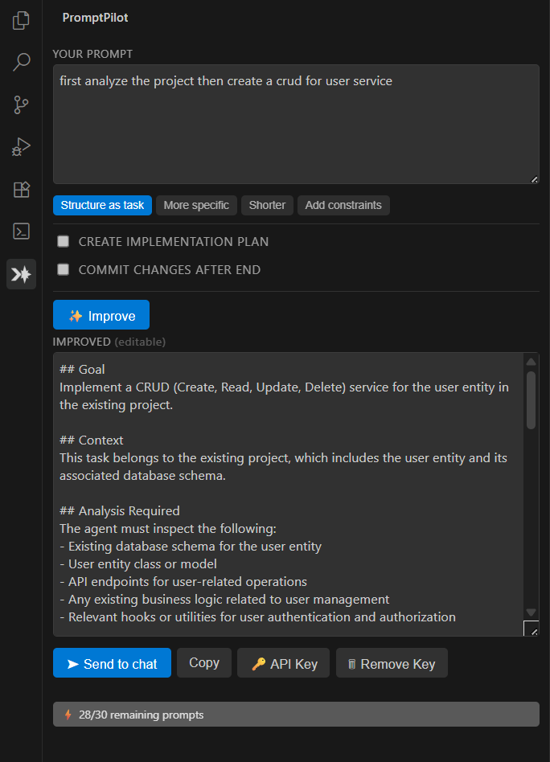

# PromptPilot ✨

> **Improve your AI prompts before you send them.**  
> Works in VS Code, Cursor, Windsurf, Claude Code — any editor. No setup required.




---

## What it does

You write a rough prompt. PromptPilot rewrites it into a sharper, better-structured version — then you send it straight to your AI chat in one click.

**Before:**
```
make the login faster and fix the bug in auth
```

**After (Structure as task preset):**
```
## Goal
Optimize login performance and fix the authentication bug.

## Context
The current login flow has a noticeable delay and an intermittent auth failure.

## Constraints
- Do not change the public API surface
- Maintain backward compatibility with existing sessions
- Add error handling for all auth failure cases

## Expected output
- Updated auth service with the performance fix applied
- Unit test covering the previously failing case
- Summary of what changed and why
```

---

## Features

- **4 improvement presets** — Structure as Task / More Specific / Shorter / Add Constraints
- **Works everywhere** — VS Code, Cursor, Windsurf, any VS Code fork
- **Zero setup** — just install and use. No API key required by default.
- **Your own key** — optionally add an OpenAI, Groq, Anthropic, or Ollama key for unlimited use
- **Send to chat** — injects the improved prompt directly into Copilot Chat, Cursor Composer, or your clipboard
- **Keyboard shortcut** — `Ctrl+Alt+P` / `Cmd+Alt+P`

---

## How it works

PromptPilot uses a 3-tier LLM strategy — automatic, no configuration needed:

```
1. VS Code built-in LM (if you have Copilot — zero setup, free)
       ↓ not available?
2. Your own API key (if you added one — unlimited, your cost)
       ↓ no key?
3. Free hosted proxy → Cloudflare Workers AI / Llama 3.3 70B (always works, 30 req/day free)
```

---

## Installation

Install from the VS Code Marketplace or Open VSX (search **PromptPilot**) or:

```bash
code --install-extension promptpilot
```

---

## Optional: Add your own API key (for unlimited use)

Open the command palette (`Ctrl+Shift+P`) and run:

```
PromptPilot: Set API Key
```

Supported providers:
| Provider | Model used by default | Notes |
|----------|-----------------------|-------|
| **OpenAI** | `gpt-4o-mini` | Best quality |
| **Groq** | `llama-3.1-8b-instant` | Fastest, has free tier |
| **Anthropic** | `claude-3-5-haiku-latest` | Great for prompt tasks |
| **Ollama** | `llama3.2` | Local, 100% private, free |
| **Custom** | your choice | Any OpenAI-compatible URL |

Your key is stored securely in the OS keychain (VS Code SecretStorage — never in `settings.json`).

To remove your key:
```
PromptPilot: Remove API Key
```

---

## Settings

| Setting | Default | Description |
|---------|---------|-------------|
| `promptImprover.userProvider` | `openai` | Your API provider |
| `promptImprover.userModel` | *(provider default)* | Model name override |
| `promptImprover.userBaseUrl` | *(provider default)* | Custom base URL (Ollama, LM Studio, etc.) |
| `promptImprover.proxyUrl` | *(built-in)* | Self-host the proxy (advanced) |

---

## Self-hosting the proxy

The free proxy is a Cloudflare Worker that uses Cloudflare Workers AI (`@cf/meta/llama-3.3-70b-instruct-fp8-fast`). You can deploy your own copy:

1. Clone this repo
2. `cd worker && npm install -g wrangler`
3. Create a KV namespace: `wrangler kv namespace create RATE_LIMIT`
4. Update `worker/wrangler.toml` with your KV namespace ID
5. Deploy: `wrangler deploy`
6. Set your worker URL in VS Code settings: `promptImprover.proxyUrl`

---

## Development

```bash
git clone https://github.com/farzinhamzehi/promptpilot
cd promptpilot
npm install
npm run build   # one-shot build
npm run watch   # watch mode
# Press F5 in VS Code to launch the Extension Development Host
```

---

## Privacy

- Your prompts are sent to the improvement backend (either your own key's API, or the free proxy).
- **No silent cloud fallback**: if your own key/provider fails, you are explicitly asked before anything is sent to the free cloud proxy — and the "always allow" choice is a visible setting (`promptImprover.allowCloudFallback`).
- The free proxy **does not log prompt content** — only the IP address for rate limiting (reset daily).
- If privacy is critical, add an Ollama key to keep everything local.

---

## Development

```bash
npm install
npm run build   # esbuild bundle → dist/extension.js
npm test        # all 8 suites, 142 checks — no VS Code needed
```

The same checks run in CI on every push (`.github/workflows/ci.yml`).

---

## Changelog

See [CHANGELOG.md](./CHANGELOG.md) for full version history.

- **v0.2.0**: Hardened proxy (server-side prompt, machine+IP+global limits), consent before cloud fallback, safe chat handoff, network timeouts, result stash, dynamic quota badge, Anthropic baseUrl, new sidebar icon, full offline test suite + CI.
- **v0.1.6**: Persistent per-machine daily quota (no reset on reinstall).
- **v0.1.2**: Added screenshot preview, custom market & sidebar icons, Cloudflare Workers AI backend.
- **v0.1.1**: Added custom activity bar icon & license.
- **v0.1.0**: Initial release with 4 presets & 3-tier LLM engine.

---

## License

MIT
